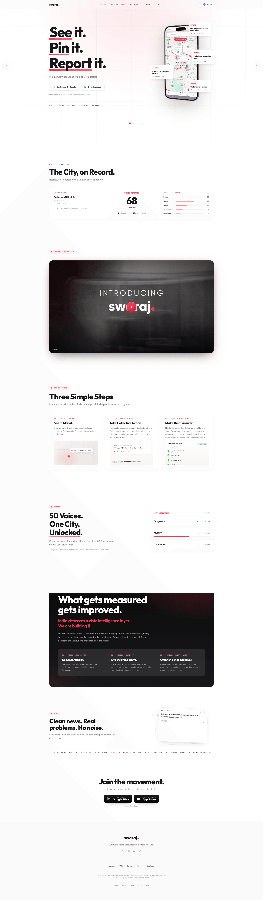

# DESIGN.md: Swaraj visual reference (Nagara)

## Source
- URL: https://swarajapp.com/ (https://swarajapp.com/create redirects to `/?next=/create` without auth)
- Capture date: 2026-09-03
- Evidence: Firecrawl branding scrape (`.firecrawl/swaraj-branding.json`) and full-page screenshot (`.firecrawl/swaraj-screenshot.png`).

Do **not** copy Swaraj logos, wordmarks, “See it. Pin it. Report it.”, Google Sign-in, or their issue copy.

## Reference Screenshot

Use this screenshot as the visual source of truth for layout, hierarchy, density, and feel. Tokens below describe the same page in machine-readable form.

## Design Summary
High-contrast civic marketing: white paper, near-black ink, one hot red pin color. Outfit display + Figtree body. Huge headlines, generous whitespace, a phone-map mockup as the hero object, floating issue callout cards, a live pulse strip, then dark cinematic blocks. Energy is medium-modern, newsroom-meets-product.

Landing in this repo is **not** a 1:1 clone. `/` is a full-viewport Bengaluru aerial with a centered **Enter the world** control. Product copy (pulse, steps, WebMCP) lives on `/world`. `/create` is a full-viewport map + report sheet using the same tokens.

## Design Tokens

### Colors
Observed from branding scrape (confidence 0.95):

| Role | Hex | Use |
|---|---|---|
| primary / pin | `#EC324E` | Theme color, map pins, selected chips, live dots |
| ink / secondary | `#101828` | Headings, dark sections, nav |
| text | `#18181B` | Body on white |
| accent / ok | `#16A34A` | Pulse active, resolved, links |
| paper | `#FFFFFF` | Default background |
| hairline | `rgba(16,24,40,0.10)` | inferred — card and input borders |
| muted | `#6B7280` | inferred — meta, timestamps |
| dark-stage | `#0B0B0B` | inferred from screenshot — video / principle blocks |
| chip-waste | `#EC324E` | inferred — keep unused on landing lead |
| chip-flood | `#0B6E99` | inferred — flooding hero category |
| chip-water | `#1D4ED8` | inferred |
| chip-lake | `#047857` | inferred |
| chip-works | `#B45309` | inferred |

### Typography
Observed:

- Heading: **Outfit** (Google Fonts)
- Body: **Figtree**
- Mono: **JetBrains Mono** (labels, LIVE, kicker)

Scale (observed / inferred):

- H1: 72–104px, weight 700, tracking tight, line-height ~0.92
- H2: 40–56px, weight 600
- Body: 17–19px, line-height 1.55
- Kicker: 11px mono uppercase, letter-spacing 0.18em

### Spacing And Layout
- Base unit: 12px
- Observed radius: 2px on some controls; **buttons/cards 12–14px** (button scrape). Prefer 12px for chips/cards, 14px for primary CTA. Not pill-everything.
- Container: ~1120–1200px inferred
- Section padding: 72–120px vertical inferred
- Nav: centered wordmark, links left, sign-in right (replace sign-in with File a voice)

## Components

### Nav
Thin, sticky on white. Centered brand (original name). Text links: How it works, Map, About. Right: outline “Open map” + solid “File a voice”.

### Buttons
- Primary: white fill, `#101828` text, 12px radius, hairline + soft shadow (observed `buttonPrimary`). Use for “Continue” replacements — **no Google button**.
- Secondary on dark: transparent, white text, 14px radius, inset highlight (observed `buttonSecondary`).
- Chips: 12px radius, uppercase 11px, selected = primary fill.

### Hero (this product)
Full-viewport Bengaluru aerial on `/`. Title overlay **nagara** + centered **Enter the world** → `/world`. Straight looping video — no cursor-tilt, no music player, no scroll-scrub chapters.

Copy on `/world` (flooding-first — not waste/potholes): the city on record, three moves, WebMCP.

CTA after unlock: File a voice / Open the map.

Video: royalty-free Bengaluru aerial (Pexels), stored under `public/media/`.

### Pulse / stats
Pills: `LIVE · n voices` and `n in last 24h`. Green LIVE dot.

### Voice cards
Small white cards, category kicker in mono, title Outfit 18–22px, meta muted. Used on `/world` and `/create` selection.

### Category pulse
Horizontal bars (screenshot): Flooding first, then Water, Lakes, Works. Do not lead with Roads/Waste.

### Three steps
01 Document  02 Join an existing voice  03 Keep it on record (this app, not BBMP).

### Map create sheet
Full viewport. Left/bottom sheet: photo drop, area name, category chips, submit. Pins use primary. Selected voice + related-tender rail.

## Page Patterns

`/`
1. Bengaluru aerial, title, Enter the world

`/world`
1. City on record (latest voice, voice count, category bars)
2. Three steps
3. WebMCP strip
4. Footer: wordmark only

`/create`
1. Full-bleed map of Bengaluru
2. Floating report sheet (photo + area)
3. Pins for seeded Flooding / Water / Lakes / Works voices
4. Tender rail when a voice is selected

Responsive: stack sheet under map below 960px.

## Content Style
Short civic sentences. No slogan theft. Dual-crisis line allowed: flooded streets and empty wells are one system. CTAs are verbs: File, Open, Support. Kickers in mono. Do not mention potholes or garbage as the lead issue.

## Agent Build Instructions
1. Tokens live in `src/app/globals.css` as CSS variables. Fonts: Outfit, Figtree, JetBrains Mono via `next/font/google`.
2. Do **not** add shadcn or Base UI wrappers. Native buttons + the aerial hero only.
3. `/` is cinematic video + CTA. `/world` is Swaraj-rhythm sections with Nagara copy.
4. `/create` map + sheet from these tokens.
5. Original brand **Nagara**. No Swaraj assets at runtime.

## Rerun Inputs
workflow: firecrawl-website-design-clone
source_url: https://swarajapp.com/
target_stack: Next.js 16 App Router, React 19, Tailwind v4, 21st.dev-style components (no shadcn)
output: DESIGN.md
